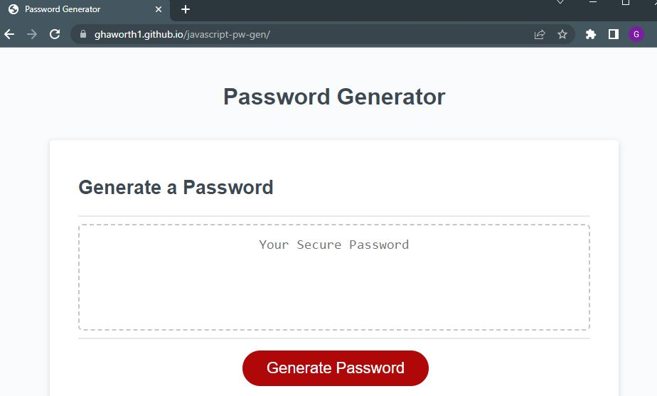

# JavaScript Password Generator

A simple web app that generates a password based off of user inputs about length, cases, numbers, and specail characters.

## Authors

- [@ghaworth1](https://www.github.com/ghaworth1)

## Links

[Live link](https://ghaworth1.github.io/javascript-pw-gen/)

## Screenshots

## License

[MIT](https://choosealicense.com/licenses/mit/)